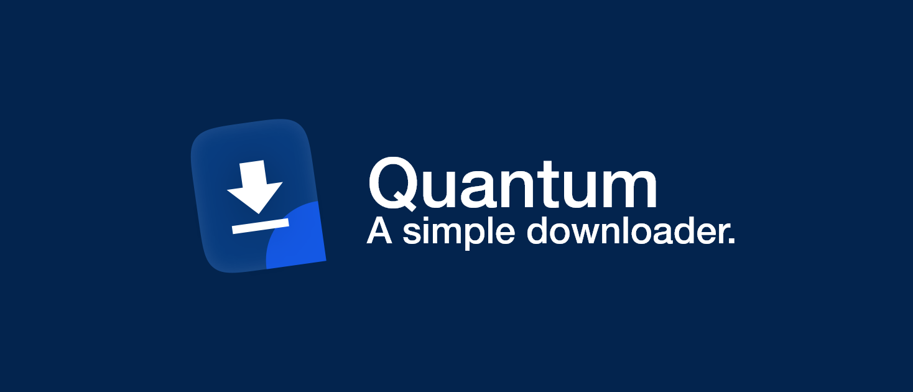

# Quantum - A simple downloader

This project was inspired by [Leo's](https://github.com/LeoLezury) download manager prototype, I changed the UI and made it a dotStudio project.

**Still in development, some features may be unstable.**

## Download

Get the latest binaries from [Releases Page](https://github.com/dot-open/quantum/releases).

Releases will be ready when it's stable, clone this repo and build if you want to try it :)

## What and Why

Quantum is a simple downloader written in C#.

It supports multi-threaded download, which can make the download time much shorter than the browser.

We started this project because the download speed of the browser was super slow. I know there are many download managers that support multi-threading, but what I wanted was to integrate plugins to ensure other download needs.

## Features

Adding, deleting, pausing, resuming and saving download tasks, customizing thread count and user agent.

More Features can be brought to quantum by installing plugins.

## Language

We now support multiple languages. If your language is not in the list, please modify these files:

```diff
+ quantum/Resources/Language/中文.xaml
```

quantum/Views/Container.xaml.cs

```diff
public class LanguageManager
{
  public static List<string> GetAllLang = new List<string>
  {
    "English.xaml", 
+   "中文.xaml"
  };
  ...
}
```

You can add your language to our repo via Pull Requests.
